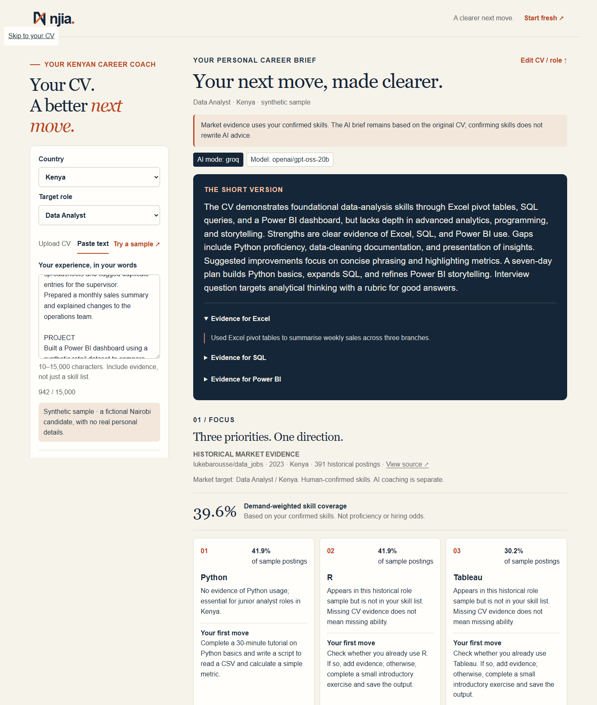
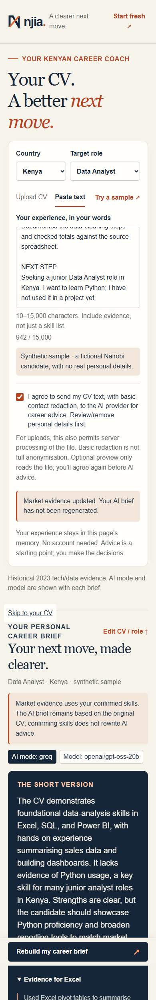

# Njia — Your CV. A better next move.

**[Live app](https://gomycode-2026.vercel.app) · [Source](https://github.com/Eeshan-Vaghjiani/njia) · [Presentation PDF](https://github.com/Eeshan-Vaghjiani/njia/blob/main/presentation/Njia-Dhruzzz.pdf) · [90-second demo MP4](https://github.com/Eeshan-Vaghjiani/njia/releases/download/demo-v1/njia-demo-90s.mp4)**

A mobile-first career coach for Kenyan tech and data job seekers. Njia asks what your CV doesn't say, turns your experience into evidence-linked strengths and a practical week, matches you to **live jobs you can apply for**, and preps you with **real interview questions found on the web**.

**Team Dhruzzz · Kenya · ONLINE**
Eeshan Vaghjiani (lead), Bhavin Mepani and Dhruvin Bhudia. Primary award: **Click Mobile — Mobile-First Impact Award**.

## The problem

Job seekers can struggle to explain their experience, identify useful skill gaps, find openings they are actually eligible for and prepare for real interviews. Generic advice rarely connects their CV, a target role, today's vacancies and tomorrow's action. Njia brings these decisions into one browser journey.

## How it works

1. **Give context.** Choose a country and target role. Upload PDF/DOCX/TXT, paste experience, or try the labelled fictional sample, then consent to AI processing.
2. **Njia asks before it advises.** Groq (or the configured NVIDIA backup) reads the redacted CV and asks 3–5 quick follow-up questions: skills the CV doesn't clearly show (*Used it at work / in a project or course / still learning / not yet*) and one detail question about an outcome. Answering is optional; **Skip** always works.
3. **A brief shaped by your answers.** Strengths with exact CV quotes, three priorities, draft rewrites (which may use facts you supplied, labelled *Uses your answer — verify*), seven daily actions and interview guidance. Answers add or remove suggested skills.
4. **Live jobs you can apply for.** Remote postings from the [Himalayas](https://himalayas.app) jobs API whose location restrictions include your country (or are worldwide), plus local postings found by Groq's built-in web search and kept only when their link appears in the search tool's results. Each job shows eligibility, posting date, matched and missing skills and a skill-overlap %, and links to the source to apply.
5. **Real interview questions, then practise.** Groq web search finds questions candidates report being asked for the role, each with its source link. Practise an answer (separate consent) and get a 1–5 score, a STAR checklist, strengths, improvements and a stronger outline that must not add numbers or tools you didn't mention.
6. **Take it with you.** Review skills and recalculate historical market evidence, send the seven-day checklist to WhatsApp, copy it, or download an HTML brief. CV-evidence quotes and rewrite sections are excluded by default.

**Try it:** open the live app → choose the sample → consent → *Build my career brief* → answer the quick questions → explore priorities, live jobs and interview practice. If a provider is unavailable or its output fails validation, Njia returns a clearly labelled curated brief, curated questions or checklist feedback instead.

## Screenshots

Actual public-app captures using a clearly labelled synthetic CV; cropped for readability.



<details>
<summary>View the mobile experience</summary>



</details>

## Quick start

Use **Python 3.12 or 3.13**. The prepared dataset is included.

```powershell
python -m venv .venv
.\.venv\Scripts\python.exe -m pip install -r requirements.txt
.\.venv\Scripts\python.exe -m uvicorn njia.app:app --host 127.0.0.1 --port 8000 --no-access-log
```

Open **http://127.0.0.1:8000**. On Linux/macOS, use `python3` to create the environment and `.venv/bin/python` for subsequent commands.

The app loads a root `.env` when present; use `.env.example` as a reference. For AI coaching, set these **server-side**:

```dotenv
GROQ_API_KEY=your_server_side_key
GROQ_MODEL=openai/gpt-oss-20b
# Optional backup for questions, brief and feedback if Groq fails (free key from build.nvidia.com):
NVIDIA_API_KEY=your_server_side_nvapi_key
```

`NJIA_ADVISOR_MODEL`, if set, overrides the advisor model. Without a Groq key, configured NVIDIA inference is still available for follow-up questions, the brief and practice feedback; without either usable provider, these return labelled curated/checklist results and still require consent. Web research requires Groq and defaults to **`NJIA_SEARCH_MODEL=openai/gpt-oss-120b`**, not the 20b coaching model. `NJIA_AI_PROVIDER=offline` controls only the older `/classic` planning flow; it does not disable the new coach. Installation and hosted inference need network access.

Provider fallback is bounded to one NVIDIA request: the brief can fail over on provider errors or invalid assessments; questions/feedback fail over on shared-client provider errors, while their later feature-validation failures go directly to curated questions/checklist feedback. Web search has no NVIDIA fallback.

## Evidence and tests

**126 backend tests passed offline** (reported by the main workflow). The latest **90.000-second** public-app recording passed **19 checks**, with **zero late cues, zero JavaScript errors and zero mocked responses**. These are separate from the older **57 public assertions (48 acceptance + 9 recording)**, not a combined total.

- [Latest recording evidence](https://github.com/Eeshan-Vaghjiani/njia/releases/download/demo-v1/njia-coach-demo-results.json): Groq `openai/gpt-oss-20b` returned four follow-ups in **1.271 s** (including upload), the brief in **1.450 s**, and feedback in **0.844 s**, scoring the sample answer **4/5**. The UI showed **8 remote + 3 local job cards**, and **8 web interview questions from 3 source URLs** using `openai/gpt-oss-120b`.
- [Separate local NVIDIA test](https://github.com/Eeshan-Vaghjiani/njia/releases/download/demo-v1/nvidia-fallback-results.json): with Groq forced unavailable, actual NVIDIA `openai/gpt-oss-20b` returned **5 validated questions in 11.564 s** and a **validated seven-day brief in 16.637 s**, one request each. NVIDIA is configured on the latest live deployment; this local test is not footage or proof of production failover. NVIDIA Brev was not used.
- The successful take followed an initial cache-warming failure and three failed recording attempts. The full session made **27 application POSTs**, including warm-up; search endpoint calls may hit caches and are not a provider-call/token bill. The final **0.390 s** interview response was cached, not fresh-search latency. One separately observed search consumed **93,301 tokens**; exact full-session token use/cost is unavailable. See [session disclosure](docs/AI_DISCLOSURE.md#data-and-evaluation).

The latest features are deployed at the same live URL. The regenerated eight-page PDF/PPTX, recording JSON, NVIDIA JSON and voiceover are **published at the existing URLs**. Final video delivery is **MP4 (H.264, 1280×720, 25 fps, faststart, approximately 4.2 MB)**, converted from the latest corrected 90-second recording, 1× and silent. Two narration captions were corrected in postproduction; the recording JSON's `caption_corrections` pixel-preservation checks apply to the lossless corrected WebM source. WebM is retained only as an optional source; the MP4 conversion makes no app/model output content edits.

Run the backend suite:

```powershell
.\.venv\Scripts\python.exe -m pip install -r requirements-dev.txt
.\.venv\Scripts\python.exe -m unittest discover -s tests -v
```

These are engineering checks, not independent model-accuracy or employment-outcome studies. Mobile browser checks are not physical-phone user research. Next: consented Kenyan usability sessions, broader rewrite-faithfulness evaluation and refreshed market data.

## Privacy and limitations

- **Consented CV text goes to Groq or the configured NVIDIA backup** (follow-up questions and the brief). The default backup is the same open-weight model (`openai/gpt-oss-20b`) on the NVIDIA API Catalog, with results labelled `nvidia`; it also works when the Groq key is absent. Basic contact scrubbing is best effort, not anonymization; names, employers and other identifying details may remain. Remove sensitive details before consenting. Practice answers go to the AI provider only with their own consent checkbox.
- **Web searches never receive CV text.** Live-job and interview-question searches send only the role, country and top market skill names to Groq's built-in browser search (powered by Exa). Results are cached in server memory per role/country (Himalayas 1 h, web jobs 12 h, interview questions 24 h), because one browser search can use ~90K Groq tokens.
- **Live postings are third-party listings.** Njia shows only postings open to your country according to the listing, links to the source (Himalayas credited as required) and drops web results whose link can't be found in the search results. It does not verify employers, deadlines or eligibility beyond the listing. A found source proves the search returned that page, not that every word is quoted exactly. Confirm each posting on the source site before applying. Match % is skill overlap with the skills Njia can detect in the posting, not a hiring probability.
- Uploads are parsed on the hosting server. The app uses request/browser memory with **no application-level CV storage**, accounts, analytics or user database. This does not describe hosting/Groq/NVIDIA retention or guarantee secure erasure. Downloads remain on the user’s device.
- **Review every generated claim.** The latest successful recording's rewrite added unsupported **“support inventory decisions”** despite the candidate specifying a personal synthetic-data dashboard, not real business use. Earlier output invented “real-time sales monitoring” and an unstated practice-outline purpose. Passing checks and “Uses your answer — verify” labels do not establish factual faithfulness; every draft needs human review.
- Market figures come from **18,371 historical 2023 tech/data postings across ten African/MENA countries**, not live vacancies or a representative labour-market survey. Below 50 local role postings, Njia labels a broader ten-country sample. Coverage measures top-15 skill demand, not proficiency or hiring odds. Live jobs never change these historical figures.
- Prepared data documentation attributes the corpus to [lukebarousse/data_jobs](https://huggingface.co/datasets/lukebarousse/data_jobs) and identifies Apache-2.0; provenance/licensing were not independently verified.
- Browser uploads are capped at 4,000,000 bytes; the parser accepts 5 MiB. Scanned PDFs need external OCR or pasted text.

## Stack and documentation

Python/FastAPI, static HTML/CSS/JavaScript, Groq (`openai/gpt-oss-20b` for JSON coaching; `openai/gpt-oss-120b` with built-in `browser_search` for research), the NVIDIA API Catalog as a configured JSON-call backup running `openai/gpt-oss-20b`, the Himalayas public jobs API, scikit-learn historical retrieval, unittest and Playwright; hosted on Vercel. OpenCode assisted coding, documentation and review. The eight-page deck was regenerated locally with python-pptx and Playwright. See the disclosure for actual AI use and boundaries.

- [Deployment](docs/DEPLOYMENT.md) · [AI and data disclosure](docs/AI_DISCLOSURE.md)
- [Submission answers](docs/SUBMISSION_DRAFT.md) · [Final checklist](docs/FINAL_CHECKLIST.md) · [Official requirements](docs/HACKATHON_REQUIREMENTS.md)
- [Ready voiceover script](docs/VOICEOVER.md) · [Release assets](https://github.com/Eeshan-Vaghjiani/njia/releases/tag/demo-v1)

**Submission status:** latest deliverables are published at the same URLs. The official form has **not been submitted**.
